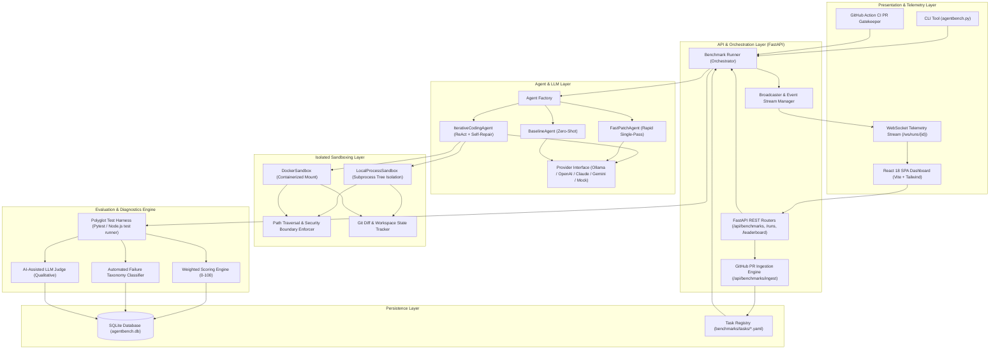
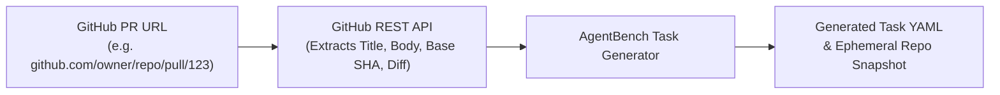
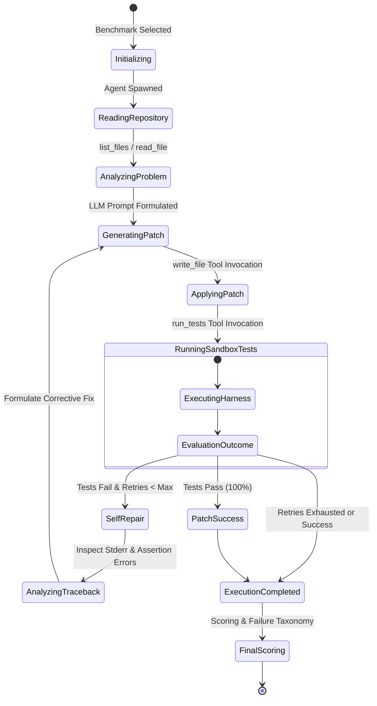
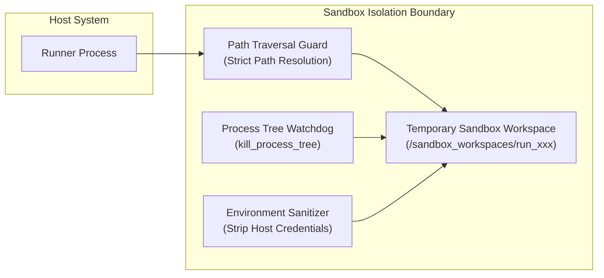
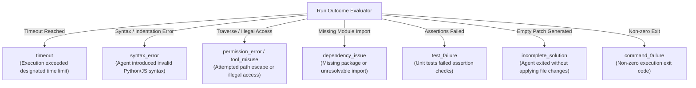
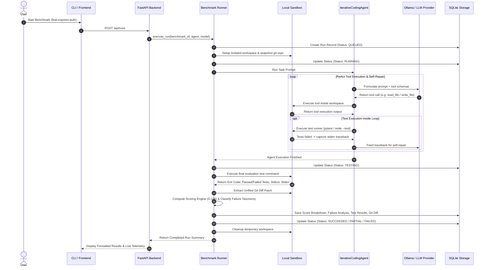

# AgentBench: Comprehensive Project Technical Specification & Interview Guide

---

## 1. Executive Summary & Problem Statement

### 1.1 The Problem with Existing AI Benchmarks
Traditional LLM code generation benchmarks (such as HumanEval, MBPP, or simple synthetic leetcode tests) evaluate models in isolation using static string generation and basic `exec()` assertions. These benchmarks suffer from fundamental limitations:
1. **No Tool Interaction**: They measure single-pass generation (`pass@1`) rather than an autonomous agent's ability to explore a filesystem, read multiple interrelated source files, invoke unit test runners, analyze tracebacks, and self-repair code iteratively.
2. **Synthetic / Toy Environments**: They evaluate isolated self-contained functions rather than realistic, multi-file software repositories with dependencies, configurations, and complex edge cases.
3. **Data Contamination**: Most public single-file benchmarks have leaked into foundational model training corpora.
4. **Lack of Automated Failure Diagnostics**: Existing frameworks yield binary pass/fail outcomes without categorizing whether a failure was caused by syntax errors, assertion errors, timeout loops, tool misuse, or sandbox permission violations.

### 1.2 The AgentBench Solution
**AgentBench** is a provider-agnostic, local-first evaluation and benchmarking platform designed to test, compare, and calibrate autonomous AI coding agents on realistic software-engineering tasks inside isolated, reproducible execution environments.

AgentBench provides:
* Multi-turn **ReAct agent orchestration** with filesystem tools (`read_file`, `write_file`, `list_files`, `run_tests`).
* **Deterministic sandboxing** with path traversal blocking, process tree timeouts, and environment isolation (`LocalProcessSandbox` and `DockerSandbox`).
* **12 Standardized Multi-Language Benchmarks** across Python (`pytest`) and Node.js/React (`node --test`).
* **GitHub Issue & Pull Request Ingestion Tool** that automatically downloads GitHub PR metadata, commit SHAs, and patch diffs to create benchmarks dynamically.
* **CI/CD PR Gatekeeper** (`.github/workflows/agentbench-eval.yml`) to evaluate coding agents on live pull requests before merge.
* **Multi-metric weighted scoring engine** evaluating correctness, test pass rate, code quality, execution efficiency, and repair reliability.
* **Automated Failure Taxonomy Classifier** that extracts actionable root causes and remediation suggestions from test tracebacks.
* **Universal LLM provider support** (Free local-first execution via Ollama, alongside OpenAI, Anthropic, Google Gemini, and fast Mock engines).
* **High-contrast, modern developer web dashboard & telemetry** (FastAPI backend + React/TypeScript/Tailwind frontend).

---

## 2. High-Level System Architecture



---

## 3. Core Capabilities & Feature Breakdown

### 3.1 12 Standardized Software-Engineering Benchmarks
AgentBench includes 12 standardized software-engineering benchmark tasks spanning realistic domains:

| Task ID | Task Name | Stack | Category | Difficulty | Evaluation Focus |
|---|---|---|---|---|---|
| `fix-auth-jwt` | Fix JWT Authentication & Token Security | Python | Bug Fixing | Medium | Algorithm confusion (`alg: none`), expired signature validation, secret key handling. |
| `feat-fastapi-pagination` | Implement API Pagination & Bounds | Python | Feature | Easy | Zero-indexed page calculations, slicing bounds, total count metadata. |
| `fix-rate-limiter` | Fix Sliding Window Rate Limiter Logic | Python | Bug Fixing | Easy | Expired timestamp pruning, window boundary calculations, burst rejection. |
| `fix-sql-builder` | Parameterized SQL Query Builder | Python | Bug Fixing | Easy | SQL injection vulnerability elimination with `?` placeholders. |
| `fix-lru-ttl-cache` | LRU Cache with TTL Expiration | Python | Bug Fixing | Medium | Dual-policy eviction: time-to-live expiration and least-recently-used ordering. |
| `fix-csv-pipeline` | Data Pipeline Ingestion & Cleaners | Python | Bug Fixing | Medium | Corrupt timestamp parsing, zero division guard, negative value filters. |
| `refactor-tree-serializer` | Refactor Tree Serializer with Cycle Detection | Python | Refactoring | Medium | Cycle detection in graph structures to prevent infinite recursion / stack overflow. |
| `feat-config-loader` | Typed Configuration Loader & Env Overrides | Python | Feature | Easy | Type coercion (strings to integers/booleans) and environment variable precedence. |
| `debug-async-queue` | Async Task Queue Worker & Heartbeats | Python | Debugging | Medium | Dead-worker heartbeat timeout detection, unacknowledged task requeueing. |
| `debug-markdown-parser` | Markdown Link & Image AST Parser | Python | Debugging | Easy | Regex token extraction into structured Abstract Syntax Tree (AST) node objects. |
| `feat-express-auth` | Express API Auth & Token-Bucket Rate Limiter | Node.js | Feature | Medium | Bearer token validation and in-memory token-bucket rate limiting middleware. |
| `fix-react-hook-leak` | Fix React Hook Event & Timer Memory Leak | React / Node | Bug Fixing | Medium | Dangling event emitter listeners and uncleared `setInterval` polling timers upon unmount. |

---

### 3.2 GitHub PR & Issue Ingestion Tool



* **CLI Usage**:
  ```bash
  python agentbench.py ingest https://github.com/fastapi/fastapi/pull/1234 --category "Bug Fixing"
  ```
* **Mechanism**:
  1. Queries the GitHub API to fetch issue descriptions, commit base SHAs, and raw unified patch diffs.
  2. Creates a task YAML (`benchmarks/tasks/gh-<repo>-<pr>.yaml`) and local workspace snapshot.
  3. Registers the task in the database for immediate execution.

---

### 3.3 CI/CD GitHub Action PR Gatekeeper

AgentBench provides an automated GitHub Action workflow (`.github/workflows/agentbench-eval.yml`) that functions as an independent verification gatekeeper for AI-generated code on Pull Requests:
1. Runs full regression tests across the repository.
2. Executes the designated coding agent against Python and Node.js benchmark tasks in isolated CI runners.
3. Automatically posts an evaluation matrix and pass/fail verdict to the PR conversation.

---

### 3.4 Agent Architectures



1. **`IterativeCodingAgent` (Default)**:
   * Multi-turn autonomous ReAct loop.
   * Discovers repo structure via `list_files`, inspects code via `read_file`, applies edits via `write_file`, and executes sandbox test suites via `run_tests`.
   * When tests fail, it captures stdout/stderr tracebacks and triggers autonomous self-repair retry loops up to the configured retry threshold.
2. **`FastPatchAgent`**:
   * Low-latency single-pass agent.
   * Reads repository files and formulates a direct patch in a single reasoning step without heavy iterative looping.
3. **`BaselineAgent`**:
   * Zero-shot calibration agent designed to establish benchmark difficulty baselines.

---

### 3.5 Multi-Provider LLM Integration
AgentBench provides a uniform provider abstraction:
* **Ollama (Free Local-First)**: Direct HTTP integration with local Ollama daemon (`http://localhost:11434`), supporting local models such as `qwen2.5-coder:1.5b` and `deepseek-r1:1.5b` at **$0.00 API cost**.
* **Cloud LLM APIs**: OpenAI (`gpt-4o`, `gpt-4o-mini`), Anthropic (`claude-3-5-sonnet`), and Google Gemini (`gemini-1.5-pro`, `gemini-1.5-flash`).
* **Mock Provider**: Fast deterministic mock engine for continuous integration (CI) test suites and sub-second smoke tests.

---

### 3.6 Multi-Layer Isolated Sandboxing



* **LocalProcessSandbox**:
  * Clones repository snapshots into ephemeral isolated temporary workspaces (`sandbox_workspaces/run_xxx`).
  * Enforces directory traversal protection: rejects any file reads or writes outside the workspace root (`resolve().relative_to(root)`).
  * Executes commands using OS subprocesses with rigorous process tree timeout termination (terminating child and grandchild processes on Windows and Linux).
  * Environment sanitization: strips sensitive host environment variables.
* **DockerSandbox**:
  * Optional containerized execution mounting the workspace volume inside an isolated container with disabled network access and memory/CPU limits.

---

### 3.7 Mathematical Scoring Engine

The overall score $S \in [0, 100]$ is computed using a weighted composite function:

$$S = w_1 \cdot \text{Correctness} + w_2 \cdot \text{TestPassRate} + w_3 \cdot \text{CodeQuality} + w_4 \cdot \text{Efficiency} + w_5 \cdot \text{Reliability}$$

Default configuration weights:
* $w_1 = 0.50$ (50% Correctness): Binary task success and exit code verification.
* $w_2 = 0.25$ (25% Test Pass Rate): Ratio of passed unit tests ($\frac{\text{passed}}{\text{total}} \times 100$).
* $w_3 = 0.10$ (10% Code Quality): Assessment based on Git diff compactness, non-empty modifications, or qualitative AI judge review.
* $w_4 = 0.10$ (10% Efficiency): Scaled score based on execution duration vs. configured timeout threshold.
* $w_5 = 0.05$ (5% Reliability): Penalty scaling based on number of retry iterations required to reach a passing state.

---

### 3.8 Automated Failure Mode Taxonomy

AgentBench classifies non-passing runs into explicit root-cause categories:



---

## 4. End-to-End Execution Lifecycle



---

## 5. Technology Stack Summary

### 5.1 Backend
* **Python 3.12**: Modern asynchronous runtime utilizing typing, `dataclasses`, and `asyncio`.
* **Node.js 22 & npm**: Native test runner and runtime for JavaScript/TypeScript polyglot benchmarks.
* **FastAPI**: Asynchronous REST API routing, OpenAPI/Swagger documentation generation, and WebSocket event broadcasting.
* **SQLAlchemy 2.0**: Typed ORM managing relational SQLite schema (`benchmarks`, `runs`, `score_breakdowns`, `failure_analyses`, `test_results`, `tool_calls`, `events`).
* **Pydantic v2**: High-speed data validation and serialization for schemas, configurations, and benchmarks.
* **Pytest & Node Test Harness**: Industry-standard unit test evaluation harnesses.
* **Uvicorn**: High-performance ASGI web server.
* **Httpx**: Asynchronous HTTP client for Ollama, GitHub REST API, and external LLMs.
* **Rich**: Terminal formatting library for the AgentBench CLI interface.

### 5.2 Frontend
* **React 18 & TypeScript**: Component-driven SPA architecture with strong type safety.
* **Tailwind CSS**: Custom **Black + Orange + White** design system with ambient glows, dark surfaces, and responsive grids.
* **Vite**: Ultra-fast build tool and bundler.
* **Recharts**: Responsive SVG charting library for score trajectories, leaderboards, and quality vs. cost scatter plots.
* **Lucide React**: Vector iconography.

---

## 6. Interview Talking Points & Architecture Highlights

When discussing AgentBench in a technical interview, emphasize these core architectural decisions:

### 1. Why local-first evaluation with Ollama?
> *"Most agent benchmarking platforms rely exclusively on proprietary cloud APIs, incurring substantial financial costs and latency during iterative development. AgentBench was architected with a local-first design: developers can run the entire 12-task suite against local models like Qwen 2.5 Coder or DeepSeek R1 via Ollama on consumer hardware for $0.00 in API costs, with deterministic offline reproducibility."*

### 2. How does the GitHub PR Ingestion engine work?
> *"Rather than forcing users to manually write benchmark configurations, AgentBench includes an automated ingestion engine. It talks to GitHub's REST API, extracts the problem statement from the issue/PR description, isolates the base commit, packages the patch diff, and generates a structured benchmark task YAML file in seconds."*

### 3. How is sandbox security handled without Docker dependencies?
> *"While Docker is supported, many local development environments or CI runners lack root Docker privileges. AgentBench implements `LocalProcessSandbox` with strict path traversal checks (`os.path.commonpath`), sanitized child environment variables, and asynchronous OS-level process-tree termination (`psutil.Process.children(recursive=True)`), preventing infinite subprocess hangs."*

### 4. What makes AgentBench's scoring objective?
> *"Rather than relying purely on LLM-as-a-Judge (which is noisy and non-deterministic), AgentBench relies primarily on actual test harness execution (pytest and Node.js exit codes and assertion pass rates) inside the modified repository. Qualitative AI Judge evaluations are purely optional complements to the ground-truth test suite."*

---

## 7. Key CLI Commands

```bash
# Diagnostic environment health check
python agentbench.py doctor

# List all 12 registered benchmark tasks
python agentbench.py list

# Ingest any GitHub Pull Request into an AgentBench task
python agentbench.py ingest https://github.com/fastapi/fastapi/pull/1234

# Run a benchmark with real local Ollama LLM
python agentbench.py run --benchmark feat-express-auth --provider ollama --model qwen2.5-coder:1.5b

# Inspect run details, failure analysis, and git diff patch
python agentbench.py inspect RUN-0003

# View global leaderboard across agent architectures and models
python agentbench.py leaderboard

# Compare two runs side-by-side
python agentbench.py compare RUN-0002 RUN-0003

# Launch full unified Web Dashboard and FastAPI server
python agentbench.py serve --port 8000
```
