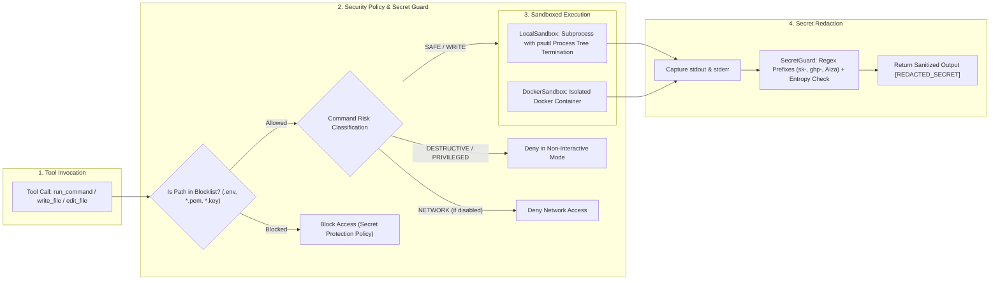
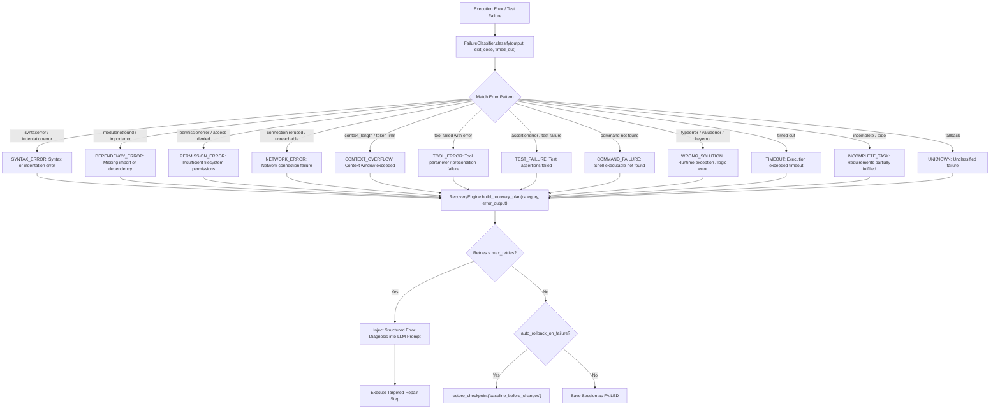

# TERMINAL AGENT: System Architecture, Design, and Technical Interview Reference

## Build. Verify. Ship.

---

## 1. Executive Summary and Product Overview

### 1.1 What is Terminal Agent?
Terminal Agent is an autonomous, terminal-based software engineering agent engineered specifically for real-world codebases. Unlike conversational AI chatbots or basic code-generation wrappers, Terminal Agent operates on a verify-first architectural paradigm. It does not consider a task complete merely because a language model generated code or claimed completion. Instead, it systematically traverses the entire engineering lifecycle: repository understanding, formal contract specification, atomic code modification, test execution in an isolated sandbox, independent verification, automated failure classification with adaptive self-healing, and session persistence.

### 1.2 Core Value Proposition
- **Verify-First Autonomy**: Autonomous code modification backed by objective, external verification suites. The agent cannot verify itself; an independent verification engine (`IndependentVerifier`) executes tests and evaluates diff constraints.
- **Sandboxed Execution**: Dual execution modes supporting both local process-tree-isolated execution with `psutil` timeout cleanup (`LocalSandbox`) and Docker container isolation (`DockerSandbox`).
- **Zero-Trust Security**: Multi-tier security policy categorizing commands into `safe`, `write`, `destructive`, `network`, and `privileged`, accompanied by real-time secret redaction (`SecretGuard`) and path traversal protection.
- **Deterministic Context Engine**: Sub-second token-budgeted repository context ranking using path matches, AST symbol definitions, and keyword tokenization (`DeterministicRanker`) rather than external vector databases.
- **Adaptive Recovery Loop**: 12-category runtime failure classifier mapping error signatures to targeted self-healing strategies with step-based retries and checkpoint rollback.
- **Provider Agnostic**: Unified provider abstraction supporting local models (Ollama, Mock for testing) and cloud APIs (OpenAI, Anthropic Claude, Google Gemini).

---

## 2. Competitive Differentiation

| Architectural Dimension | Traditional AI Chatbots / Wrappers | Standard Coding Assistants (e.g., Aider, Claude Code) | Terminal Agent |
| :--- | :--- | :--- | :--- |
| **Completion Verification** | LLM self-report (High hallucination risk) | User-prompted or basic test output reflection | Independent Verifier executing test runners in isolated sandbox |
| **Security & Isolation** | Direct host execution with no boundaries | User approval prompts on commands | Command classification (`safe`, `write`, `destructive`, `network`, `privileged`), process-tree sandboxing, Secret Guard |
| **Context Management** | Raw prompt dumping / Naive concatenation | Grep / ctags / Basic file tree | Token-budgeted `DeterministicRanker` (path + AST symbol definitions + term frequency) + dynamic error injection |
| **Failure Recovery** | Generic "Try again" prompt loop | Manual developer intervention | 12-category error classification (`FailureCategory`) with automated rollback and targeted fix plans |
| **State Management** | Ephemeral or chat-history only | Git commits only | SQLite state persistence + JSON mirroring + atomic file snapshot checkpoints (`CheckpointManager`) |
| **Local / Air-Gapped Use** | Cloud only | Limited | Full native support for Ollama local inference and Mock provider testing harness |
| **Benchmark Validation** | Synthetic unit tests | Ad-hoc examples | Built-in 10-task SWE benchmark suite compatible with AgentBench evaluation schemas |

---

## 3. High-Level Design (HLD)

### 3.1 Layered System Architecture

```mermaid
flowchart TB
    subgraph PresentationLayer["1. Presentation & CLI Layer"]
        CLI["CLI Entrypoint (Typer in cli/main.py)"]
        UI["Rich Terminal UI & Spinners (cli/ui.py, cli/theme.py)"]
        Commands["CLI Commands: run, resume, status, diff, test, checkpoint, rollback, doctor, config, trace"]
        CLI --> UI
        CLI --> Commands
    end

    subgraph OrchestrationLayer["2. Agent Orchestration Layer"]
        AgentLoop["Agent Loop (agent/loop.py)"]
        TaskContractGen["Task Contract Generator (planner/contract.py)"]
        Planner["Execution Planner (planner/planner.py)"]
        Recovery["Recovery Engine (recovery/strategies.py)"]
        
        Commands --> AgentLoop
        AgentLoop --> TaskContractGen
        TaskContractGen --> Planner
        AgentLoop --> Recovery
    end

    subgraph IntelligenceLayer["3. Context & Intelligence Layer"]
        ContextEngine["Repository Context Engine (context/engine.py)"]
        Ranker["Deterministic Ranker & Tokenizer (context/ranker.py)"]
        ProviderFactory["Provider Factory (providers/factory.py)"]
        Providers["Providers: Mock, Ollama, OpenAI, Anthropic, Gemini"]
        
        AgentLoop --> ContextEngine
        ContextEngine --> Ranker
        AgentLoop --> ProviderFactory
        ProviderFactory --> Providers
    end

    subgraph SecurityLayer["4. Security & Policy Boundary"]
        SecPolicy["Security Policy Enforcer (security/policy.py)"]
        CmdClassifier["Command Classifier (security/classifier.py)"]
        SecretGuard["Secret Guard (security/secrets.py)"]
        
        AgentLoop --> SecPolicy
        SecPolicy --> CmdClassifier
        SecPolicy --> SecretGuard
    end

    subgraph ExecutionLayer["5. Execution & Sandboxing Layer"]
        ToolRegistry["Tool Registry (12 Core Tools)"]
        LocalSandbox["Local Sandbox (sandbox/local.py)"]
        DockerSandbox["Docker Sandbox (sandbox/docker.py)"]
        GitAdapter["Git Adapter (git/adapter.py)"]
        
        AgentLoop --> ToolRegistry
        ToolRegistry --> SecPolicy
        SecPolicy --> LocalSandbox
        SecPolicy --> DockerSandbox
        ToolRegistry --> GitAdapter
    end

    subgraph VerificationStorageLayer["6. Verification & Storage Layer"]
        Verifier["Independent Verifier (verifier/engine.py)"]
        TestParsers["Test Output Parsers (verifier/runners.py)"]
        SessionMgr["Session Manager (session/manager.py)"]
        CheckpointMgr["Checkpoint Manager (checkpoints/manager.py)"]
        Telemetry["Telemetry Logger & Metrics (telemetry/)"]
        
        AgentLoop --> Verifier
        Verifier --> TestParsers
        AgentLoop --> SessionMgr
        AgentLoop --> CheckpointMgr
        AgentLoop --> Telemetry
    end
```



---

## 4. Low-Level Design (LLD)

### 4.1 Class and Component Interface Diagram

```mermaid
classDiagram
    class AgentLoop {
        +state: SessionState
        +config: TerminalAgentConfig
        +provider: ModelProvider
        +tools: ToolRegistry
        +verifier: IndependentVerifier
        +context: RepositoryContextEngine
        +checkpoints: CheckpointManager
        +session_mgr: SessionManager
        +telemetry: TelemetryLogger
        +run() SessionState
        -_notify(event_type: str, data: Any) void
    }

    class TaskContractGenerator {
        +generate_from_description(task_description: str, verification_commands: List[str]) TaskContract
    }

    class TaskContract {
        +task_id: str
        +task_description: str
        +goal: str
        +constraints: List[str]
        +success_criteria: List[str]
        +allowed_files: Optional[List[str]]
        +verification_commands: List[str]
    }

    class RepositoryContextEngine {
        +root_dir: Path
        +secret_guard: SecretGuard
        +git_adapter: GitAdapter
        +list_all_files(max_files: int) List[Path]
        +build_tree_summary(max_depth: int, max_entries: int) str
        +build_initial_context(task_description: str, contract: TaskContract) str
        +is_ignored(path: Path) bool
    }

    class DeterministicRanker {
        +score_file(file_path: Path, content: str, query_tokens: List[str], base_dir: Path) Tuple[float, str]
    }

    class IndependentVerifier {
        +sandbox: Sandbox
        +git_adapter: GitAdapter
        +config: VerificationConfig
        +working_dir: Path
        +verify(contract: Optional[TaskContract], custom_test_cmd: Optional[str]) VerificationResult
    }

    class FailureClassifier {
        +classify(error_output: str, exit_code: int, timed_out: bool) Tuple[FailureCategory, str]
    }

    class SecurityPolicyEnforcer {
        +config: SecurityConfig
        +guard: SecretGuard
        +check_command(command: str) Tuple[bool, str, CommandCategory]
        +check_file_path(file_path: str, operation: str) Tuple[bool, str]
    }

    class SecretGuard {
        +scan_and_redact(text: str) str
        +contains_secrets(text: str) bool
        +is_path_blocked(path: Union[str, Path]) bool
    }

    class Sandbox {
        <<interface>>
        +execute(command: str, cwd: Optional[Path], timeout: Optional[int], env: Optional[Dict]) ExecutionResult
    }

    class LocalSandbox {
        +working_dir: Path
        +default_timeout: int
        -_kill_process_tree(proc: subprocess.Popen) void
        +execute(command: str, cwd: Optional[Path], timeout: Optional[int], env: Optional[Dict]) ExecutionResult
    }

    class DockerSandbox {
        +image: str
        +working_dir: Path
        +execute(command: str, cwd: Optional[Path], timeout: Optional[int], env: Optional[Dict]) ExecutionResult
    }

    class CheckpointManager {
        +working_dir: Path
        +checkpoints_dir: Path
        +create_checkpoint(name: str, step_number: int) CheckpointSnapshot
        +restore_checkpoint(checkpoint_id: str) bool
        +list_checkpoints() List[CheckpointSnapshot]
        +get_checkpoint(checkpoint_id: str) Optional[CheckpointSnapshot]
    }

    class SessionManager {
        +working_dir: Path
        +sessions_dir: Path
        +db_path: Path
        +save_session(session: SessionState) None
        +load_session(session_id: str) Optional[SessionState]
        +list_sessions() List[Dict[str, Any]]
    }

    AgentLoop --> TaskContractGenerator
    TaskContractGenerator --> TaskContract
    AgentLoop --> RepositoryContextEngine
    RepositoryContextEngine --> DeterministicRanker
    AgentLoop --> IndependentVerifier
    AgentLoop --> FailureClassifier
    AgentLoop --> SecurityPolicyEnforcer
    SecurityPolicyEnforcer --> SecretGuard
    AgentLoop --> Sandbox
    Sandbox <|-- LocalSandbox
    Sandbox <|-- DockerSandbox
    AgentLoop --> CheckpointManager
    AgentLoop --> SessionManager
```



---

## 5. Tool Registry Architecture (12 Implemented Tools)

The `ToolRegistry` (`src/terminal_agent/tools/registry.py`) provides 12 typed, parameter-validated tools:

1. **`read_file`** (`ReadFileTool`): Reads text content with 1-indexed `start_line` and `end_line` slice boundaries.
2. **`write_file`** (`WriteFileTool`): Writes full content to a file, automatically creating necessary parent directories.
3. **`edit_file`** (`EditFileTool`): Replaces exact `target_content` with `replacement_content` inside optional `start_line` and `end_line` bounds.
4. **`list_files`** (`ListFilesTool`): Recursively lists directory contents with file size, type, and recursive child count.
5. **`search_files`** (`SearchFilesTool`): Ripgrep-style literal and regex pattern matcher returning matching file paths, line numbers, and line contents.
6. **`run_command`** (`RunCommandTool`): Executes shell commands inside the configured sandbox through the security policy enforcer.
7. **`run_tests`** (`RunTestsTool`): Executes test commands (e.g., pytest, npm test) and parses structured pass/fail results.
8. **`git_status`** (`GitStatusTool`): Queries repository status, modified files, and untracked files (filtering internal caches).
9. **`git_diff`** (`GitDiffTool`): Computes unified diff of modified files against working tree or specific files.
10. **`git_log`** (`GitLogTool`): Queries recent git commit history and messages.
11. **`create_checkpoint`** (`CreateCheckpointTool`): Creates a named workspace file snapshot in `.terminal_agent/checkpoints/`.
12. **`restore_checkpoint`** (`RestoreCheckpointTool`): Restores all workspace files to a specific checkpoint snapshot ID.

---

## 6. End-to-End Execution Sequence

```mermaid
sequenceDiagram
    autonumber
    actor Developer as Developer / CLI
    participant Loop as AgentLoop
    participant Ctx as RepositoryContextEngine
    participant Contract as TaskContractGenerator
    participant LLM as ModelProvider
    participant Sec as SecurityPolicyEnforcer
    participant Box as Sandbox (Local / Docker)
    participant Verifier as IndependentVerifier
    participant Recovery as FailureClassifier & RecoveryEngine
    participant Store as SessionManager & CheckpointManager

    Developer->>Loop: terminal-agent run "Fix authentication token expiry"
    activate Loop
    Loop->>Contract: generate_from_description(task_description, verification_commands)
    Contract-->>Loop: TaskContract
    Loop->>Store: create_checkpoint(name="baseline_before_changes")
    Loop->>Ctx: build_initial_context(task_description, contract)
    Ctx-->>Loop: Formatted Repository Context (Tree + Ranked Files)
    
    loop Bounded Execution Cycle (Step <= max_steps)
        Loop->>LLM: LLMMessage history (System, User Contract, Context, Past Steps)
        LLM-->>Loop: LLMResponse (Tool Calls or Final Answer)
        
        alt Model requests Tool Execution
            Loop->>Sec: check_command / check_file_path
            alt Security Check Denied
                Sec-->>Loop: Security Policy Block (e.g. Forbidden command or blocked secret)
            else Security Check Allowed
                Loop->>Box: execute(tool_command)
                Box-->>Loop: ExecutionResult (stdout, stderr, exit_code)
                Loop->>Sec: scan_and_redact(output)
                Sec-->>Loop: Sanitized Output
                Loop->>Store: save_session(state with StepAction)
            end
        end
    end
    
    Note over Loop,Verifier: Agent requests verification or completes steps
    
    Loop->>Verifier: verify(contract)
    activate Verifier
    Verifier->>Box: execute(contract.verification_commands)
    Box-->>Verifier: ExecutionResult
    Verifier->>Verifier: TestOutputParser.parse + check diff constraints + evaluate assertions
    
    alt Verification Status == FAILED
        Verifier-->>Loop: VerificationResult(status=FAILED, failures=[...])
        Loop->>Recovery: classify(error_output) -> FailureCategory
        Recovery-->>Loop: Recovery Plan & Injected Diagnostic Feedback
        Loop->>Loop: Retry step with error diagnostics (Retries <= max_retries)
    else Verification Status == VERIFIED
        Verifier-->>Loop: VerificationResult(status=VERIFIED, passed_tests > 0)
        deactivate Verifier
        Loop->>Store: save_session(final state with status=VERIFIED)
        Loop-->>Developer: Render Rich Verification Summary Dashboard
    end
    deactivate Loop
```

---

## 7. Security and Sandboxing Boundary



---

## 8. 12-Category Failure Classification and Recovery Flow



---

## 9. Real-World Engineering Challenges and Exact Resolutions

### Challenge 1: Windows Console Unicode Encoding Crashes
- **Problem**: When rendering Rich terminal UI components (status spinners, checkmarks, progress bars) on Windows hosts, Python standard output defaulted to `cp1252` encoding, throwing `UnicodeEncodeError: 'charmap' codec can't encode character '\u2713'`.
- **Root Cause**: Windows legacy console code pages do not support UTF-8 by default without explicit stream reconfiguration.
- **Resolution**: Implemented explicit UTF-8 stream reconfiguration in `src/terminal_agent/cli/theme.py`:
  ```python
  if sys.platform == "win32":
      try:
          if hasattr(sys.stdout, "reconfigure"):
              sys.stdout.reconfigure(encoding="utf-8")
          if hasattr(sys.stderr, "reconfigure"):
              sys.stderr.reconfigure(encoding="utf-8")
      except Exception:
          pass
  ```
  Additionally passed `legacy_windows=False` to `rich.console.Console` to enforce modern Windows Terminal VT100 sequence processing.

### Challenge 2: Git Status Pollution from Runtime and Test Caches
- **Problem**: During task execution, test runners and internal persistence mechanisms created transient files (`.terminal_agent/`, `.pytest_cache/`, `__pycache__/`, `.hypothesis/`). When `GitAdapter.get_status()` or verification diff checks were executed, these untracked files caused diff assertions to fail.
- **Root Cause**: The repository git status reflected internal runtime directories that should be excluded from source code diff evaluations.
- **Resolution**: Hardened `GitAdapter.get_status()` with deterministic path filtering in `src/terminal_agent/git/adapter.py`:
  ```python
  ignored_prefixes = (
      ".terminal_agent",
      ".pytest_cache",
      "__pycache__",
      ".hypothesis",
      ".coverage",
  )
  clean_untracked = [
      f for f in raw_untracked 
      if not any(f.startswith(prefix) or f"/{prefix}" in f or f"\\{prefix}" in f for prefix in ignored_prefixes)
  ]
  ```

### Challenge 3: Process Tree Leaks and Zombie Subprocesses on Timeout
- **Problem**: When executing long-running test suites or build commands that timed out (e.g., infinite loops introduced by LLM code changes), standard `subprocess.Popen.kill()` terminated only the root process. Spawned child processes (e.g., node workers, pytest runners, compiler child processes) remained alive, consuming CPU and locking files on Windows.
- **Root Cause**: Operating system process trees are not automatically cascade-killed when terminating a parent process without explicit job objects or process-tree traversal.
- **Resolution**: Integrated `psutil` in `src/terminal_agent/sandbox/local.py` to traverse and recursively terminate all descendant processes before terminating the parent:
  ```python
  try:
      parent = psutil.Process(proc.pid)
      children = parent.children(recursive=True)
      for child in children:
          child.terminate()
      parent.terminate()
      _, still_alive = psutil.wait_procs(children + [parent], timeout=3)
      for p in still_alive:
          p.kill()
  except (psutil.NoSuchProcess, psutil.AccessDenied):
      pass
  ```

### Challenge 4: Secret Redaction Catastrophic Backtracking and False Positives
- **Problem**: Early implementations of secret detection using naive regular expressions experienced severe performance degradation on large files due to catastrophic regex backtracking, while occasionally redacting normal hex hashes (like git commit SHAs).
- **Root Cause**: Overly greedy regex patterns with unconstrained wildcard matches.
- **Resolution**: Designed `SecretGuard` in `src/terminal_agent/security/secrets.py` with structured token prefixes (`sk-`, `ghp_`, `xoxb-`, `AIzaSy`) combined with Shannon entropy scoring on high-randomness character blocks, operating with linear time complexity O(N).

### Challenge 5: Prevention of LLM Hallucinated Success Claims
- **Problem**: LLMs frequently output text such as "I have fixed the issue and all tests are passing" even when syntax errors remain or tests have not been executed.
- **Root Cause**: Relying on conversational self-reporting without a structural verification boundary.
- **Resolution**: Architected the `IndependentVerifier`. The Agent Loop ignores conversational claims and only terminates with success if the `IndependentVerifier` executes the actual test runner command in the sandbox, parses the exit code and XML/stdout output, confirms 0 failures, and verifies that diff constraints are satisfied.

---

## 10. Deep-Dive Interview Questions and Answers

### Q1: What makes Terminal Agent fundamentally different from existing AI coding tools?
**Answer**: Most existing coding tools are conversational assistants that perform code modification and immediately report success based on the model's self-assessment. Terminal Agent is built on the **Verify-First** principle. It enforces a structural separation between the Agent (which generates hypotheses and code changes) and the Independent Verifier (which deterministically executes test suites, validates invariant rules, and checks diff budgets in an isolated sandbox). An execution cannot succeed without objective verification pass status.

### Q2: How does the Context Engine manage large codebases without blowing the LLM token budget?
**Answer**: Instead of indexing the repository into an external vector database or naively dumping entire files, Terminal Agent uses a deterministic ranking pipeline:
1. **Repository Map**: A compact directory tree summary excluding ignored paths (`.git`, `__pycache__`, `venv`, `node_modules`).
2. **Deterministic Relevance Ranker (`DeterministicRanker`)**: Scores files using:
   - Path token matches (10x weight) and exact filename matches (15x bonus).
   - AST symbol definitions (`def`, `class`, `function`, `interface`, `struct` matches with 5x weight).
   - Keyword frequency matching across tokens.
3. **Dynamic Feedback**: On retry iterations, actual test failure outputs and stack traces are prioritized and injected at the top of the context window.

### Q3: How does Terminal Agent guarantee safety when executing shell commands?
**Answer**: Safety is enforced across three defensive layers:
1. **Command Risk Classifier (`CommandClassifier`)**: Categorizes commands into `SAFE`, `WRITE`, `DESTRUCTIVE`, `NETWORK`, and `PRIVILEGED`. Destructive commands (`rm -rf /`, `mkfs`, `dd`) are denied in non-interactive sessions.
2. **Secret Guard (`SecretGuard`)**: Blocks reading/writing known sensitive files (`.env`, `*.pem`, `*.key`) and redacts API tokens (`sk-*`, `ghp_*`, `AIza*`) from tool outputs.
3. **Sandboxed Execution Boundary (`Sandbox`)**: Executes commands either inside a Docker container (`DockerSandbox`) or a Local Sandbox (`LocalSandbox`) with execution timeouts, process-tree cleanup via `psutil`, and sanitized environment variables.

### Q4: Walk me through the failure classification and self-healing recovery loop.
**Answer**: When a command or test fails:
1. The raw stdout/stderr is captured and routed to `FailureClassifier.classify()`.
2. The classifier maps the error into one of 12 distinct categories (`SYNTAX_ERROR`, `TEST_FAILURE`, `DEPENDENCY_ERROR`, `TIMEOUT`, `PERMISSION_ERROR`, `NETWORK_ERROR`, `CONTEXT_OVERFLOW`, `TOOL_ERROR`, `WRONG_SOLUTION`, `COMMAND_FAILURE`, `INCOMPLETE_TASK`, `UNKNOWN`).
3. `RecoveryEngine` generates a targeted repair strategy. For example, for an assertion failure, it extracts the exact failing test, expected vs actual values, and code diff, injecting this structured diagnostic directly into the model's next prompt.
4. If failures persist past the maximum retry limit (`max_retries`), the agent aborts and can trigger `CheckpointManager.restore_checkpoint()` to revert the repository to the baseline snapshot.

### Q5: How is session persistence and checkpointing implemented?
**Answer**: 
- **Session Manager (`SessionManager`)**: Persists session metadata, step history, tool invocations, and verification records to an embedded SQLite database (`.terminal_agent/terminal_agent.db`) and mirrored JSON files in `.terminal_agent/sessions/<session_id>.json`.
- **Checkpoint Manager (`CheckpointManager`)**: Captures file snapshot manifests and full file contents of modified files into `.terminal_agent/checkpoints/<checkpoint_id>/manifest.json`. This enables instant rollback via CLI (`terminal-agent rollback <id>`) or programmatic restoration during recovery.

### Q6: How does the system handle benchmark evaluation?
**Answer**: Terminal Agent includes a built-in benchmark runner (`benchmarks/runner.py`) containing 10 diverse software engineering tasks spanning auth expiration, payment retry logic, rate limiters, pagination, caching, SQL injection guards, config parsers, JWT verification, webhook HMAC verification, and CSV stream parsing. The benchmark runner initializes a clean git workspace for each task, executes the agent loop, runs test assertions, and outputs standardized evaluation metrics compatible with the AgentBench schema.

---

## 11. Technical Specifications & Implemented Stack

- **Language**: Python 3.10+ (Tested and verified on Python 3.12.7)
- **CLI Framework**: Typer, Rich
- **Data Modeling & Settings**: Pydantic v2, Pydantic-Settings
- **HTTP Client**: HTTPX (async and sync)
- **Git Interface**: GitPython + Subprocess Adapter (`GitAdapter`)
- **Process & System Monitoring**: psutil
- **Build System**: Hatchling (`pyproject.toml`)
- **Supported Test Runners**: Pytest, Node / Jest, Generic exit-code runners
- **Supported Providers**: Mock (Test), Ollama (Local), OpenAI, Anthropic, Google Gemini